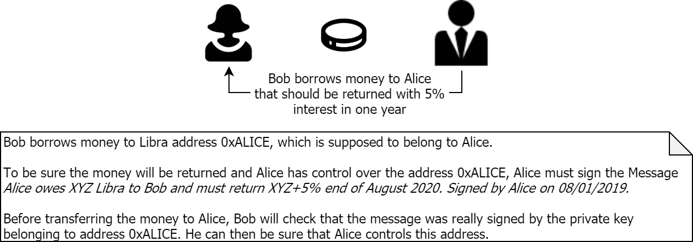

# Libra Message Signer and Verifier (jlibra extension) 

Implements a message signing and verification mechanism using Libra accounts (ie. associated key pairs).  
Can be used to check if a message was signed by a certain Libra address to prove ownage of this address. 

### Prerequisites

* Java 8+
* Maven 3+ (optional)

### Use

To use signing and verifying messages out of the scope of custom Java applications, `libra-java-client` can be used.

### Run

Run the [downloaded binary](https://github.com/ice09/java-libra-client/releases) (must be alpha-2+) with this command in a shell:
```
java -jar java-libra-client-0.0-alpha-2.jar
```

The application should start with a jlibra splash screen and a shell.  

```
       _ ___ __
      (_) (_) /_  _________ _
     / / / / __ \/ ___/ __ `/    .: Connecting Libra to Java :.
    / / / / /_/ / /  / /_/ /
 __/ /_/_/_.___/_/   \__,_/
/___/

jlibra:>a c

Created account with Libra address: 9d0a6a7a4c07dfaaa4bfa950d4a1ba64721c6d0b700b81dddcf79b33bab6fad1
Public key  302a300506032b65700321003d8099c5d6752dd8f9d6c066d716d04eaeb53b4a010add4ab949cfdcefc8a91e
Private key 3051020101300506032b657004220420935623304e37057ee49a059b2ed461cc2a2d66eda2333e905fce6be92946c4888121003d8099c5d6752dd8f9d6c066d716d04eaeb53b4a010add4ab949cfdcefc8a91e

jlibra:>s m 'Hello' 0

Signed message is dedd66677267fe2582d0e4bbb14507776537fd138483ea80f3512ec36c25431ca218ed90d08283a9991b3e894e98b2eddc71ce99b19c35a8e2fb4e6c1f546704

jlibra:>v m 'Hello' dedd66677267fe2582d0e4bbb14507776537fd138483ea80f3512ec36c25431ca218ed90d08283a9991b3e894e98b2eddc71ce99b19c35a8e2fb4e6c1f546704 0

Message was signed by provided public key.

jlibra:>v m 'hello' dedd66677267fe2582d0e4bbb14507776537fd138483ea80f3512ec36c25431ca218ed90d08283a9991b3e894e98b2eddc71ce99b19c35a8e2fb4e6c1f546704 0

Message was NOT signed by provided public key.

```

### Real Life Use Case



#### Process Flow for IOU Use Case

* Alice sends Bob her address (0xALICE) and her public key (0xPUBKEY).
  * Optional: Bob can let Alice send a transaction, check the address and then retrieve the public key from the events.
* Alice should sign a message sent by Bob to her (which includes a Nounce or timestamp to prevent replay attacks).
* Bob can verify that Alice signed the message by verifying the signed message against the public key.
* Bob knows that Alice controls address 0xALICE and can safely transfer money to this address.
* Optional: The message could be a contract, by signing the message Alice accepts the contract.

As a result, Alice signed the contractual agreement and gets the money transferred to the address which signed the message.  
There is no possibility of fraud in the process without necessity  of a trusted 3rd party.
  
